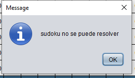
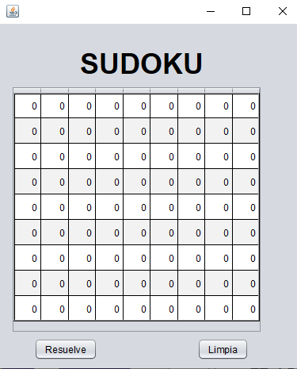

# Sudoku Solver
> Este proyecto es una implementación en java de un solucionador de sudoku. Al correr el programa el usuario ingresa una tabla de sudoku. Si la tabla tiene solución, el programa la encuentra y la regresa al usuario. 

## Tabla de contenidos
* [Información general](#información-general)
* [Ejecución del proyecto](#ejecución-del-proyecto)
* [Reglas de Sudoku](#reglas-de-sudoku)
* [Implementación de conjuntos](#implementación-de-conjuntos)
* [Contacto](#contacto)

## Información general
Desarrollé este proyecto para la clase de Estructuras de Datos en el ITAM. El propósito era poner en práctica los temas de recursión, herencia y conjuntos para desarrollar una solución al rompecabezas conocido como sudoku. Cada fila, columna y región del sudoku está representada por un conjunto dentro del programa. Se utiliza la función recursiva resuelve(int renglón, int columna) para recorrer el tablero y tratar de encontrar una solución. Puede ocurrir que el tablero ingresado por el usuario no tenga solución. En dado caso que no se pueda resolver, el programa avisa al usuario por medio de un MessageDialog. 

## Ejecución del proyecto
Para ejecutar el proyecto necesitas un IDE como [Netbeans](https://netbeans.org/) o [Eclipse](https://www.eclipse.org/) que pueda correr programas escritos en Java.  Una vez dentro del IDE, puedes seguir los siguientes pasos:
1. Crea un nuevo proyecto con el nombre de tu preferencia.
2. Dentro del proyecto copia y pega los siguientes archivos del repositorio:
    * `ConjADT.java`
    * `ConjuntoA.java`
    * `InterfazSudoku.java`
    * `IteradorArreglo.java`
3. Corre el archivo `InterfazSudoku.java` y debe aparecer la siguiente pantalla:

5. Para editar el tablero, haz dobleclick en cualquier casilla e inserta un valor con tu teclado. El valor 0 indica que la casilla esta vacía.
6. Para resolver el tablero, haz click en el boton 'resuelve' 
7. Para restaurar el tablero, haz click en el boton 'limpia'

## Reglas de sudoku
El sudoku esta compuesto por un tablero de 9x9. Podemos dividirlo en columnas, filas o regiones de 3x3 como aparece a continuación:

## Implementacion de conjuntos

## Contacto
Creado por [@aperelman21](https://www.flynerd.pl/) - feel free to contact me!
