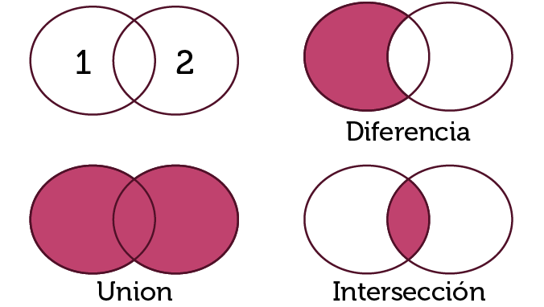

# Sudoku Solver
> Este proyecto es una implementación en Java de un solucionador de Sudoku. Al correr el programa el usuario ingresa una tabla de Sudoku. Si la tabla tiene solución, el programa la encuentra y la regresa al usuario. 

## Tabla de contenidos
* [Información general](#información-general)
* [Reglas del Sudoku](#reglas-del-sudoku)
* [Implementación de conjuntos](#implementación-de-conjuntos)
* [Ejecución del proyecto](#ejecución-del-proyecto)
* [Contacto](#contacto)

## Información general
Cada fila, columna y región del sudoku está representada por un conjunto dentro del programa. Se utiliza la función recursiva `resuelve(int renglón, int columna)` para recorrer el tablero y tratar de encontrar una solución. Puede ocurrir que el tablero ingresado por el usuario no tenga solución. En ese caso, el programa avisa al usuario por medio de un MessageDialog. 

## Reglas del Sudoku
El Sudoku está compuesto por un tablero de 9x9 casillas. Podemos dividirlo en columnas (verde), filas (rojo) y regiones de 3x3 (azul) como aparece a continuación:

Para resolver un Sudoku, cada casilla vacía se tiene que completar con un solo número del 1 al 9. Para llenar las casillas se tienen que seguir estas tres reglas:
* En una misma fila no puede haber números repetidos
* En una misma columna no puede haber números repetidos
* En una misma región de 3x3 no puede haber números repetidos

## Implementación de conjuntos
La principal estructura de datos utilizada en este proyecto es el conjunto. Un conjunto es una colección de elementos que se puede definir por ejemplo como el conjunto A = {1,2,3,4,5}. La funcionalidad que tienen los conjuntos en esta implementación es bastante básica. Se puede agregar o eliminar un elemento a un conjunto, se puede checar si un conjunto contiene un cierto elemento y calcular cuantos elementos hay en un conjunto (esto se conoce como la cardinalidad del conjunto). Finalmente, se pueden aplicar las operaciones de unión, intersección y diferencia entre dos conjuntos. Estas tres últimas operaciones están ejemplificadas con los siguientes diagramas de Venn:

## Ejecución del proyecto
Para ejecutar el proyecto es necesario tener instalado un IDE como [Netbeans](https://netbeans.org/) o [Eclipse](https://www.eclipse.org/) que pueda correr programas escritos en Java.  Una vez dentro del IDE, sigue los siguientes pasos:
1. Crea un nuevo proyecto con el nombre de tu preferencia.
2. Dentro del proyecto, copia y pega los siguientes archivos del repositorio:
    * `ConjADT.java`
    * `ConjuntoA.java`
    * `InterfazSudoku.java`
    * `IteradorArreglo.java`
3. Corre el archivo `InterfazSudoku.java` y debe aparecer la siguiente pantalla:

4. Para editar el tablero, haz doble click en cualquier casilla e inserta un valor con tu teclado. El valor 0 indica que la casilla está vacía.
5. Para resolver el tablero, haz click en el botón 'resuelve' 
6. Para restaurar el tablero, haz click en el botón 'limpia'

## Contacto
Creado por [@aperelman21](https://github.com/aperelman21/)
Desarrollé este proyecto para la clase de Estructuras de Datos en el ITAM. El propósito era poner en práctica los temas de recursión, herencia y conjuntos para desarrollar una solución al rompecabezas conocido como Sudoku. 
